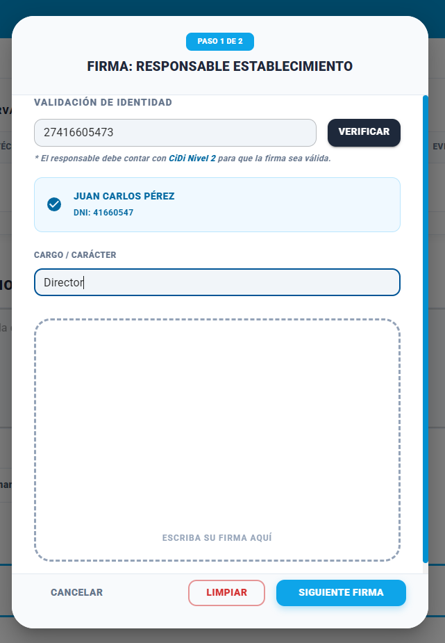
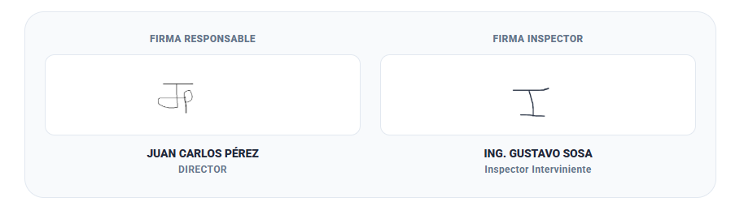

### Historia de Usuario

**Como** Inspector,  
**Quiero** consolidar el acta y capturar las firmas digitales de ambas partes,  
**Para** finalizar la inspección.

### Descripción

**Flujo de Firma:**

1. Se ingresa el CUIL del Responsable del Establecimiento. (Búsqueda por CUIL). Se selecciona el "Cargo/Carácter".
2. Firma el Responsable del Establecimiento. (Pad de dibujo).
3. Firma el Inspector interviniente. (Pad de dibujo).

### Criterios de Aceptación

1. El Responsable del Establecimiento debe estar registrado como CIDI Nivel 2.

2. Si el CUIL ingresado no posee CiDi Nivel 2, el sistema debe bloquear el flujo de firma y mostrar un mensaje de error: "El Responsable del Establecimiento debe contar con Ciudadano Digital Nivel 2 verificado para firmar el acta."

3. Después de validar la identidad con el CUIL con CiDi Nivel 2, el sistema debe mostrar un input que diga "especifique el cargo".

4. El componente visual debe permitir el trazo manual. Debe contar con un botón de "Limpiar" para reintentar el trazo antes de confirmar.

5. Al completarse ambas firmas, el sistema debe mostrarlas en el pie de página del Acta de Inspección, junto con Nombre, Apellido, CUIL y cargo/carácter responsable.

6. Si en el campo **FORMATO INSPECCIÓN** el valor seleccionado fue **VIRTUAL**, el sistema no debe solicitar ni mostrar las firmas de ninguna de las partes (ni del Responsable ni del Inspector). Si debe solicitar el CUIL del responsable del Establecimiento (con la validación de CIDI Nivel 2) y el cargo/carácter del mismo.

7. - **Modal de Opciones de Emplazamiento:** Al apretar el botón **NO APROBAR**, el sistema debe mostrar un modal para seleccionar el plazo otorgado al efector para regularizar las observaciones.
  - Opciones predefinidas: 24 horas, 48 horas, 5 días, 10 días, 15 días.
  - Opción **+ manual**: Al seleccionarla, despliega un campo para ingresar un plazo personalizado, permitiendo elegir la unidad de tiempo (Horas, Días, Semanas).
  - El sistema debe calcular dinámicamente y mostrar la fecha y hora exacta de vencimiento. El cálculo del día final **no incluye sábados, domingos ni feriados**.

