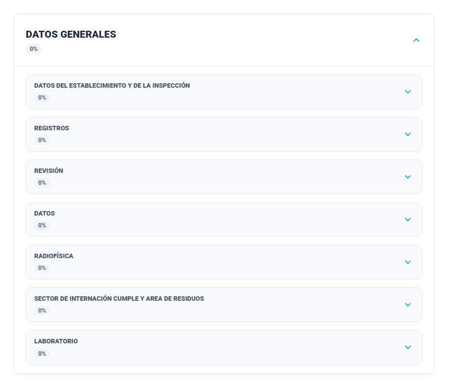
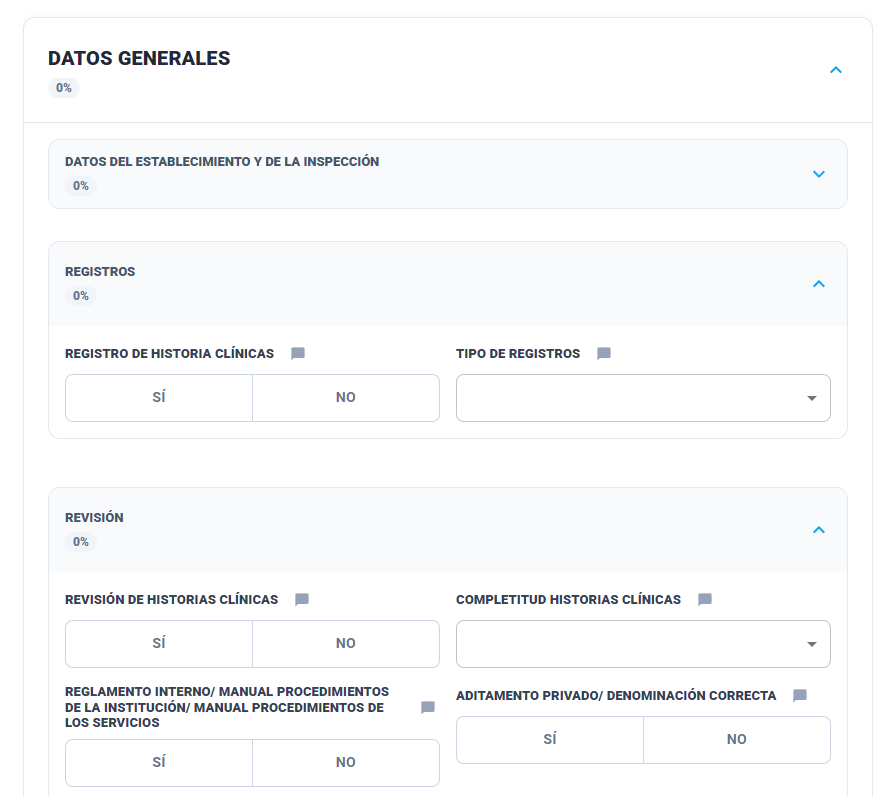
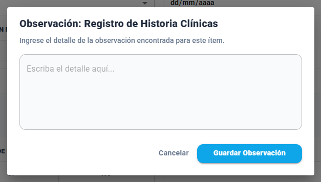

### Historia de Usuario

**Como** Inspector,  
**Quiero** evaluar ítems de cumplimiento legal y funcionamiento,  
**Para** garantizar que el establecimiento opera bajo las normas vigentes.

### Criterios de Aceptación

- Los campos de inspección son configurados por el administrador.
- El apartado "Datos del Establecimiento y de la inspección" tiene que aparecer primero y el apartado no debe permitir que se colapse. 
- Todo ítem marcado como NO debe alimentar obligatoriamente el apartado de observaciones del acta.
- El sistema debe identificar ítems "Críticos" (ej. Plan de Evacuación). Si uno de estos es marcado como NO, el dictamen sugerido al final debe ser "No Aprueba".
- Cada campo debe tener un acceso directo a un Modal de Observaciones.
- Si un campo está configurado como subsección, se visualiza como un subtítulo dentro del formulario de inspección, agrupando visualmente los ítems que le corresponden.

## Prototipo de interfaz

##### Apartado DATOS GENERALES completo

##### Apartados dentro de Datos Generales

##### Modal Observación
