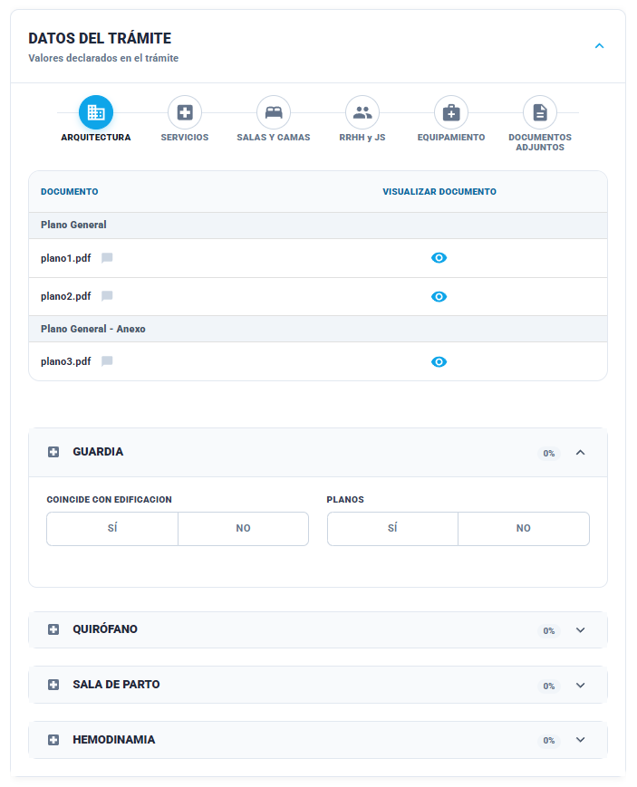

### Historia de Usuario

**Como** Inspector
**Quiero** verificar la documentación técnica de arquitectura y su correspondencia con la edificación real
**Para** asegurar que la infraestructura del establecimiento cumple con los planos declarados.

### Descripción
La interfaz presenta una tabla donde se pueden visualizar los archivos PDF cargados por el efector. Debajo, se despliegan **Acordeones por Servicio** que contienen ítems específicos de infraestructura configuradas por el administrador.

### Criterios de Aceptación

1. **Visualización de Documentos:** El sistema debe permitir abrir y visualizar los planos declarados directamente desde la tabla (columna "Visualizar Documento").
       
2. **Marcación de Irregularidad:** Si el inspector marca "NO" en cualquier ítem de arquitectura, el sistema debe tipificarlo automáticamente como Irregularidad.
    
3. **Vinculación con Servicios:** Los acordeones de arquitectura deben mostrarse solo para aquellos servicios que requieren validación de planos según la normativa y fueron configurados por el administrador.

### Prototipos de interfaz

