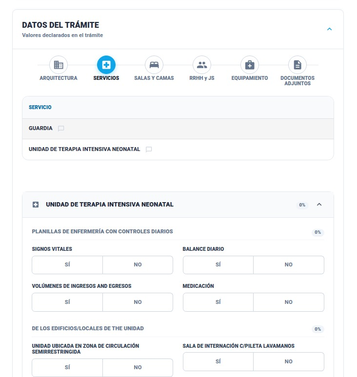

### Historia de Usuario

**Como** Inspector,  
**Quiero** verificar la existencia física de los servicios frente a lo declarado,  
**Para** identificar faltantes o servicios no operativos en el establecimiento.

### Descripción
La interfaz presenta el relevamiento en dos niveles: 
1. **Tabla Servicios** que funciona muestra un listado de existencia de los servicios declarados. 
2. **Acordeones**, donde se detallan las **sub-áreas técnicas e ítems** específicos (ej. cantidad de camas, salas de espera, gases medicinales) que requieren una validación técnica profunda.

### Criterios de Aceptación

1. **Observaciones:** El sistema debe permitir al inspector observar cualquier detalle sobre el servicio declarado mediante un botón [OBSERVACIONES].
    
2. **Irregularidad:** Si un servicio declarado no se encuentra físicamente, el sistema debe cargar la observación automáticamente como Irregularidad.
    
3. **Acordeones de Sub-áreas técnicas:** El sistema debe mostrar acordeones de validación  **únicamente** para los servicios que tengan sub-áreas técnicas configuradas por el Administrador. Si un servicio no tiene ítems de infraestructura asociados en la base de datos, no mostrará acordeón. Dentro de cada acordeón, el inspector debe validar ítems técnicos obligatorios.

