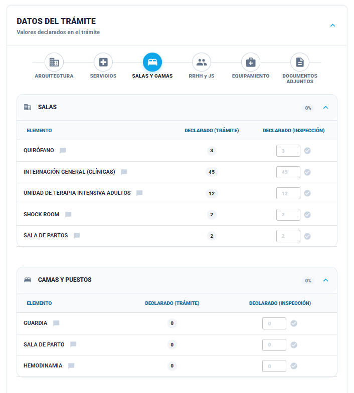

### Historia de Usuario

**Como** Inspector,  
**Quiero** comparar con lo declarado la cantidad de salas y camas de internación,  
**Para** verificar que la capacidad instalada no exceda los límites permitidos por la habilitación.
### Descripción

La interfaz presenta dos tablas principales:
- **Salas** 
- **Camas y Puestos** 
### Criterios de Aceptación

1. El sistema debe permitir al inspector cargar valores numéricos en la columna "Declarado". Por defecto, el campo puede venir pre-cargado con el valor del trámite (placeholder).
    
2. Si el valor ingresado por el inspector es **mayor** al declarado en el trámite, el sistema debe marcar automáticamente una **Irregularidad** con un ícono. 
    
3. Si el valor ingresado por el inspector es **menor** al declarado en el trámite, el sistema debe marcar una **Rectificación** con un ícono. 
    
4. El sistema debe habilitar el icono de "Observación" (globo de texto) para que el inspector cargue las observaciones que desee.

