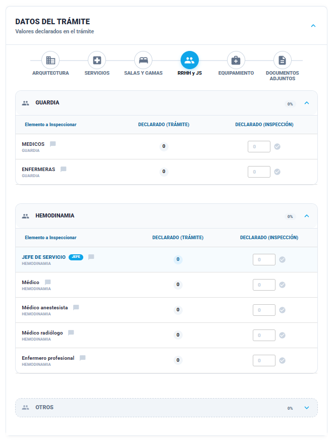

### Historia de Usuario

**Como** Inspector,  
**Quiero** verificar la cantidad del personal del plantel declarado,  
**Para** asegurar que el plantel profesional es el adecuado para la tipología del establecimiento.

### Descripción
La interfaz organiza el personal mediante **Acordeones por Servicio** (Guardia, Hemodinamia, etc.) y una sección final de \"Otros\".

Cada fila detalla el rol profesional, el número declarado en el trámite y un campo de entrada para el valor hallado en la inspección. El sistema diferencia entre personal operativo general y roles jerárquicos dentro del plantel para aplicar reglas de validación específicas.

### Criterios de Aceptación

1. El sistema debe permitir el ingreso de la cantidad de profesionales del plantel observados.
    
    - **Irregularidad:** Si la Cantidad Verificada es **menor** que la Declarada, se marca automáticamente como Irregularidad (Falta de personal mínimo declarado).
        
    - **Cumplimiento (OK):** Si la Cantidad Verificada es **mayor o igual** a la Declarada, el ítem se considera verificado satisfactoriamente.   
    
2. **Despliegue por Acordeones:** El sistema debe agrupar al plantel según el servicio al que pertenecen, permitiendo una carga organizada por áreas críticas del establecimiento.
    
3. **Plantel:** La falta de designación de uno o más integrantes del plantel implica una Irregularidad.

