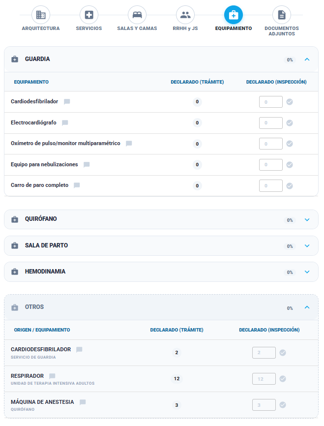

### Historia de Usuario

**Como** Inspector,  
**Quiero** verificar la cantidad física de equipos frente a lo declarado,  
**Para** identificar faltantes críticos respecto a la declaración jurada del efector.

### Descripción

La interfaz organiza los equipos mediante **Acordeones por Servicio**  una sección especial de **Otros** para equipamiento transversal.
El inspector debe ingresar la cantidad hallada en el establecimiento para cada ítem si difieren de lo declarado. El sistema realiza una validación numérica inmediata para detectar si el equipamiento disponible cumple con lo declarado por el efector.
### Criterios de Aceptación

1. **Validación Numérica por Ítem:** El sistema debe permitir el ingreso de la cantidad observada en la columna "Declarado (Inspección)".
    
    - **Irregularidad:** Si la Cantidad Real (Verificada) es **menor** a la Declarada, el sistema marca automáticamente una Irregularidad por faltante de equipamiento.
        
    - **Cumplimiento (OK):** Si la Cantidad Real (Verificada) es **mayor o igual** a la Declarada, el ítem se considera cumplido.
    
2. **Gestión de Equipamiento "Otros":** En la sección "Otros", el sistema debe listar equipos que el efector declaró pero que no están configurados como mínimo por el administrador.

