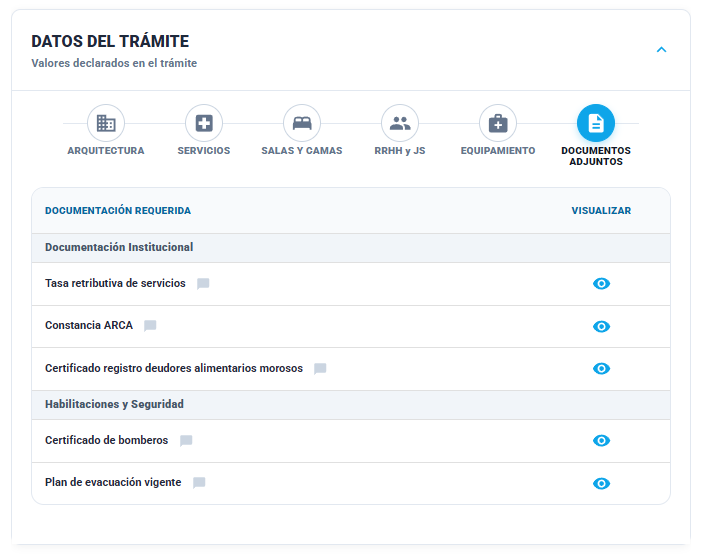

### Historia de Usuario

**Como** Inspector, **Quiero** validar la documentación institucional y de seguridad presentada en el trámite, **Para** confirmar que el establecimiento cuenta con las certificaciones y habilitaciones vigentes requeridas.

### Descripción
El apartado muestra una lista agrupada por categorías (Documentación Institucional, Habilitaciones y Seguridad, etc.). El inspector debe revisar cada documento (Tasa retributiva, Certificado de Bomberos, Plan de Evacuación) y tildar su validez mediante un selector de cumplimiento.

### Criterios de Aceptación

1. El sistema debe listar todos los documentos adjuntos y proporcionar un acceso rápido a la visualización de cada archivo.
    
2. Cada documento debe contar con un campo de notas para que el inspector detalle motivos de rechazo.

