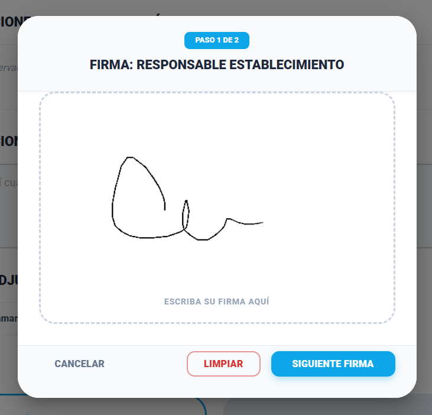
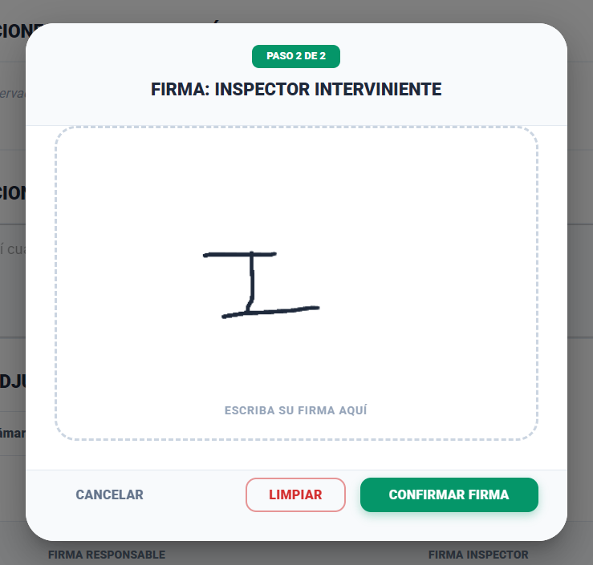
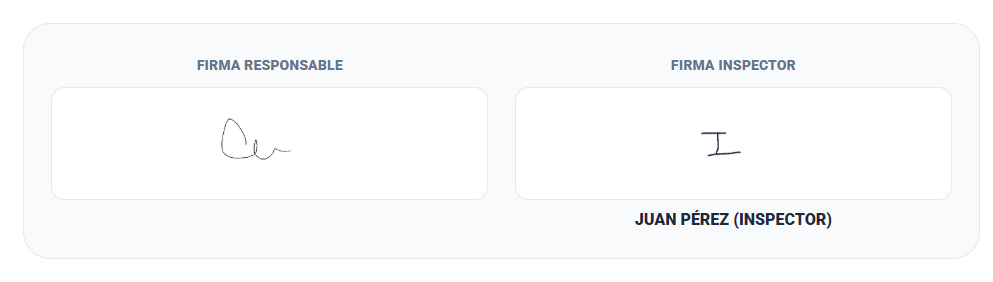

# 1. Aprobación Directa y Cambio de Estado

### Historia de Usuario

**Como** Inspector,
**Quiero** dictaminar la aprobación total de la inspección cuando no se detecten irregularidades ni faltas normativas,
**Para** que el establecimiento avance a su estado final de habilitación.

### Criterios de Aceptación

- **Condición de Activación:** Solo debe permitirse este dictamen si el sistema no registra ninguna "Irregularidad" en los módulos de Equipamiento, RRHH, Servicios o Salas y Camas.
- **Notas de Cierre:** El sistema debe solicitar obligatoriamente un breve texto de conclusión o notas finales del inspector.
- **Estado Final:** Al confirmar, el trámite debe cambiar automáticamente al estado ACEPTADO INSPECCIÓN.
- **Notificación:** Se debe disparar un aviso automático al Efector informando que su trámite ha sido aprobado exitosamente.

## Prototipo de interfaz

