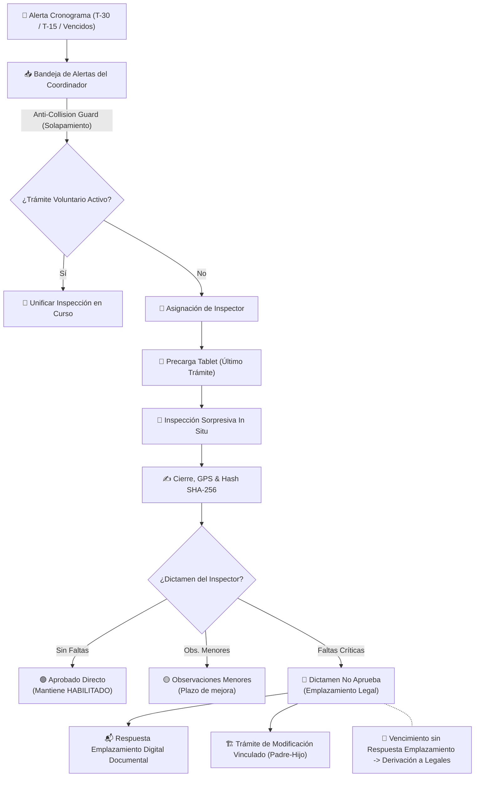

# 📋 Documento de Análisis Funcional y Arquitectura Técnica
## Trámite: Inspección por Rutina (Periódica) — ClicSalud / RUGEPRESA

> [!NOTE]
> - **Sistema:** ClicSalud / RUGEPRESA — Ministerio de Salud de la Provincia de Córdoba  
> - **Alcance:** Trámite autónomo de Inspección por Rutina (Programada / Periódica) para Establecimientos Habilitados  
> - **Estado:** `LÍNEA BASE REVISADA Y APROBADA C/ INNOVACIONES DE DESARROLLO`

---

## 1. 📌 Introducción y Alcance del Trámite

El **Trámite de Inspección por Rutina** es un procedimiento administrativo y operativo autónomo e independiente de los trámites de Habilitación Inicial o Renovación.

> [!IMPORTANT]
> **Requisito Exclusivo:** Se ejecuta únicamente sobre establecimientos de salud cuyo estado registral en el sistema sea **`HABILITADO`**.

### 🎯 Objetivos Sanitarios
* **Verificación de Continuidad:** Comprobar la vigencia de condiciones de bioseguridad, infraestructura y calidad prestacional.
* **Capacidad Instalada:** Validar la concordancia entre la distribución aprobada de salas/camas y la situación real in situ.
* **Recursos Humanos & Equipamiento:** Auditar la nómina activa de Directores Técnicos, personal de salud y operatividad del equipamiento médico.

---

## 2. 📅 Operativa de la Inspección por Rutina

### 2.1. Periodicidad Normativa y Cronograma Automático

| Tipología de Establecimiento | Frecuencia Obligatoria | Ventana de Alerta Preventiva |
| :--- | :---: | :---: |
| **Clínicas, Hospitales y Sanatorios** | **1 al año** (1/año) | < 30 días |
| **Geriátricos y Residencias de Adultos Mayores** | **3 al año** (3/año) | < 30 días |

#### 🔔 Panel de Alertas del Coordinador
* **Alerta Preventiva (< 30 días):** Indicador visual en verde/amarillo indicando inicio de ventana de programación.
* **Alerta Crítica (< 15 días):** Indicador prioritario en rojo *"Establecimiento próximo a cumplir ciclo periódico"*.
* **Alerta Roja por Caducidad:** Indicador para establecimientos que han superado los 30 días del ciclo sin emisión de orden (*Alerta Vencida Sin Fiscalización*).
* **Comportamiento del Sistema:** La alerta **no crea automáticamente un trámite** en la base de datos; notifica al Coordinador para que inicie la orden manualmente.

---

### 2.2. Modalidades de Ejecución y Confidencialidad

> [!TIP]
> **Confidencialidad y Factor Sorpresa:** La inspección presencial es estrictamente **sorpresiva**. El efector **no visualiza** el cronograma de inspección en su portal privado para evitar preparaciones previas.

| Modalidad | Carácter | Detalle Operativo |
| :--- | :--- | :--- |
| **📍 Presencial** | **Predeterminada** | Sin previo aviso in situ. Inspector provisto de Tablet (offline/online). |
| **💻 Virtual** | **Excepcional** | Notificación previa con citación Zoom/Teams y agenda documental. |

> [!CAUTION]
> **Restricción de Modalidad Virtual (RN-10):** Geriátricos, Residencias de Adultos Mayores y Sanatorios con Internación están **excluidos** de la modalidad virtual y exigen 100% inspección presencial in situ.

---

### 2.3. Precarga Automática de Línea Base y Resiliencia Offline

> [!NOTE]
> **Línea Base Automatizada:** Al aperturar la planilla de inspección en la tablet, el sistema **precarga automáticamente los datos vigentes** del **último trámite finalizado** (Habilitación Inicial o Modificación Aprobada) para auditar in situ.

> [!NOTE]
> 📱 **Resiliencia Offline en Campo:** En inspecciones presenciales sorpresivas en zonas periféricas o con baja señal 4G/5G, la tablet cuenta con un **Sync Previo/Nocturno** indexado en IndexedDB local. Permite registrar el acta en modo 100% offline y sincronizar al reconectar.

---

## 3. 🔄 Arquitectura Funcional y Flujo de Procesos

---

## 4. ⚙️ Reglas de Negocio Clave (RN)

| Código | Regla de Negocio | Descripción |
| :---: | :--- | :--- |
| **RN-01** | **Exclusividad por Estado** | Solo se inician inspecciones sobre establecimientos en estado **`HABILITADO`**. |
| **RN-02** | **Autonomía Operativa** | La inspección no suspende la habilitación salvo medida cautelar expresa. |
| **RN-03** | **Integración al Motor de Actas** | Verificación obligatoria de Servicios, Equipamiento, RRHH y Bioseguridad. |
| **RN-04** | **Precarga de Línea Base** | Carga automática de los datos aprobados del **último trámite finalizado**. |
| **RN-05** | **Confidencialidad** | Cronogramas no visibles en el portal del efector (Inspección Sorpresa). |
| **RN-06** | **Iniciación Manual** | La alerta en bandeja requiere acción manual del Coordinador para iniciar el trámite. |
| **RN-07** | **Emplazamiento a Modificación** | Si hay faltas edilicias, se emplaza al efector a crear el Trámite de Modificación Vinculado. |
| **RN-08** | **Plazo Discrecional** | El plazo de emplazamiento lo fija el inspector en el acta según la gravedad. |
| **RN-09** | **Re-Inspección (Acta N+1)** | Faltas críticas respondidas digitalmente exigen re-inspección presencial in situ. |
| **RN-10** | **Exclusión Virtual** | Geriátricos y Sanatorios con internación son 100% presenciales. |

---

## 5. 💡 Innovaciones y "Toque de Desarrollador" Implementados

1. **🎛️ Coordinador:**
   * **Smart Clustering Geográfico:** Agrupación por departamento/localidad.
   * **Anti-Collision Guard:** Detector de solapamiento con trámites de renovación en curso.
   * **Semáforo KPI:** Alertas de caducidad destacadas.

2. **📱 Inspector:**
   * **Diff Visual (Línea Base vs Realidad):** Comparación directa con contadores e indicadores de discrepancia.
   * **Quick Chips ⚡:** Inserción de observaciones frecuentes con 1 toque.
   * **Estampado Legal:** Geofencing GPS (-31.4201, -64.1888) y Hash SHA-256 del acta firmada.

3. **🏢 Efector:**
   * **Wizard Guiado de Respuesta Emplazamiento:** Evidencia Digital vs Trámite de Modificación Vinculado.
   * **Autovinculación Padre (Acta) — Hijo (Modificación):** Precarga de expediente originario.
   * **Cuenta Regresiva Visiva:** Cronómetro de vencimiento de emplazamiento.
