# Diagrama de Flujo del Proceso de Inspección

Este diagrama ilustra el recorrido completo del trámite de inspección, relacionando secuencialmente cada una de las Historias de Usuario (HUs) definidas en los módulos de Inspección Inicial, Resolución, Respuestas de Emplazamiento (Efector y Validación) y Re-Inspección.

**Referencias de Roles:**
- 🟦 **Inspector:** Tareas de auditoría, validación y dictamen (Fondo Celeste).
- 🟧 **Efector:** Tareas de revisión de hallazgos y carga de documentación rectificativa (Fondo Naranja).

```mermaid
flowchart TD
    %% Módulo 1.1: Inspección Inicial (Inspector)
    subgraph Inicial ["1.1 Inspección Inicial (Auditoría en establecimiento)"]
        A["HU 1: Sincronización y Preparación Offline<br/>*(Descarga de datos a la tablet para la inspección)*"] --> B["HU 2: Verificación de Existencia de Servicios<br/>*(Control binario de presencia física)*"]
        B --> C["HU 3: Verificación de Cantidades de Equipamiento<br/>*(Inspección por cantidades)*"]
        C --> D["HU 4: Verificación de Recursos Humanos y Jefes<br/>*(Inspección por cantidades)*"]
        D --> E["HU 5: Verificación de Salas y Camas<br/>*(Control de capacidad instalada y excesos)*"]
        E --> F["HU 6: Validación de Datos Generales y Normativas<br/>*(Control binario de requisitos legales y bioseguridad)*"]
        F --> G["HU 7: Registro de Observaciones y Evidencia<br/>*(Captura de fotos y comentarios por ítem)*"]
        G --> H["HU 8: Cierre de Acta y Firma en Tablet<br/>*(Consolidación y firmas de ambas partes)*"]
    end

    %% Módulo 1.3: Resolución de Inspección (Inspector)
    subgraph Resolucion ["1.3 Resolución de Inspección (Dictamen)"]
        H --> Dec1{¿Hay Irregularidades?}
        Dec1 -- "Ninguna" --> I["HU 1: Aprobación Directa<br/>*(Trámite pasa a estado ACEPTADO INSPECCIÓN)*"]
        Dec1 -- "Solo Menores" --> J["HU 2: Aprobación con Obs. Menores<br/>*(Sugerencias de mejora no críticas)*"]
        Dec1 -- "Faltas Críticas" --> K["HU 3: Dictamen No Aprueba y Emplazamiento<br/>*(Faltas graves, se bloquea acta y exige respuesta emplazamiento)*"]
    end

    %% Módulo 2.1: Bandeja del Efector (Efector)
    subgraph Efector ["2.1 Bandeja de Hallazgos para el Efector"]
        K --> L1["HU 1: Visualización de Hallazgos Paso a Paso<br/>*(El efector revisa detalladamente sus faltas)*"]
        L1 --> L2["HU 2: Carga de Documentación Rectificativa<br/>*(Adjunta fotos y respuesta emplazamientos justificando mejoras)*"]
        L2 --> L3["HU 3: Envío Final y Bloqueo de Edición<br/>*(Envío formal al inspector y bloqueo)*"]
    end

    %% Módulo 2.2: Validación del Inspector (Inspector)
    subgraph ValidacionDigital ["2.2 Validación de Respuestas por el Inspector"]
        L3 --> V1["HU 1: Revisión Digital de Documentación<br/>*(Vista cara a cara: Hallazgo vs. respuesta emplazamiento)*"]
        V1 --> V2["HU 2: Decisión de Re Inspección Física<br/>*(Obligatorio generar Nueva Acta)*"]
    end

    %% Retorno obligatorio a la inspección física
    V2 --> M

    %% Módulo 1.2: Re Inspección (Inspector)
    subgraph ReInspeccion ["1.2 Re Inspección (Nueva Acta)"]
        M["HU 1: Generación de Nueva Acta Vinculada<br/>*(Se crea el Acta N+1 heredando el historial)*"] --> N["HU 2: Carga de Antecedentes y Respuestas<br/>*(Vista de solo lectura del acta anterior y respuesta emplazamiento)*"]
        N --> O["HU 3: Validación de Mejoras en establecimiento<br/>*(Verificación presencial de las correcciones)*"]
        O --> P{¿Irregularidad<br/>Subsanada?}
    end

    %% Retorno al ciclo de dictamen
    P -- "SÍ (Totalmente)" --> I
    P -- "NO (Persiste falta)" --> K

    %% Estilos de los subgrafos por Rol (Colores)
    style Inicial fill:#e6f3ff,stroke:#4d94ff,stroke-width:2px
    style Resolucion fill:#e6f3ff,stroke:#4d94ff,stroke-width:2px
    style ValidacionDigital fill:#e6f3ff,stroke:#4d94ff,stroke-width:2px
    style ReInspeccion fill:#e6f3ff,stroke:#4d94ff,stroke-width:2px
    
    style Efector fill:#fff0e6,stroke:#ff8c1a,stroke-width:2px
    
    %% Estilos de Nodos de Resolución (Semáforo)
    style I fill:#d4edda,stroke:#28a745,stroke-width:2px,color:#155724
    style J fill:#fff3cd,stroke:#ffc107,stroke-width:2px,color:#856404
    style K fill:#f8d7da,stroke:#dc3545,stroke-width:2px,color:#721c24
```

### Descripción de los Módulos

1. **1.1 Inspección Inicial**: Representa el recorrido del inspector por la institución, guiando paso a paso a través de las 8 verificaciones (servicios, equipamiento, RRHH, salas, etc.), cargando observaciones y cerrando el acta con la firma de ambas partes.
2. **1.3 Resolución de Inspección**: Momento en el que el sistema asiste en la toma de decisiones. Si el acta está limpia, se aprueba directamente. Si hay faltas graves, se emite un dictamen negativo que deriva en un Emplazamiento.
3. **2.1 Bandeja de Hallazgos para el Efector**: El responsable del establecimiento accede a las observaciones agrupadas, visualiza sus faltas, e ingresa su respuesta emplazamiento junto con evidencias (fotos y archivos), enviando el paquete formalmente al ministerio para revisión.
4. **2.2 Validación de Respuestas por el Inspector**: El inspector revisa de forma digital el respuesta emplazamiento del efector. Como el sistema no permite aprobar un trámite basándose únicamente en la documentación cargada a distancia, esta validación es el paso previo obligatorio para generar la orden de una Nueva Acta y volver al establecimiento.
5. **1.2 Re-Inspección (Nueva Acta)**: El inspector vuelve al establecimiento. Genera un acta nueva heredando el historial bloqueado y la respuesta del efector, lo que le permite ir directo a validar de forma presencial si la mejora prometida se concretó en el lugar.
