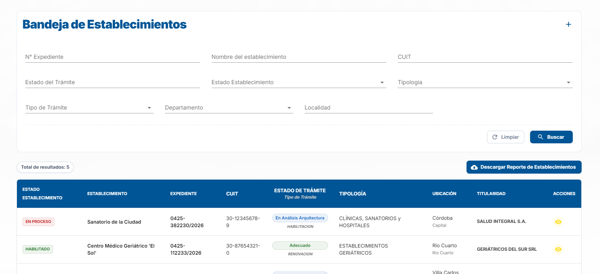
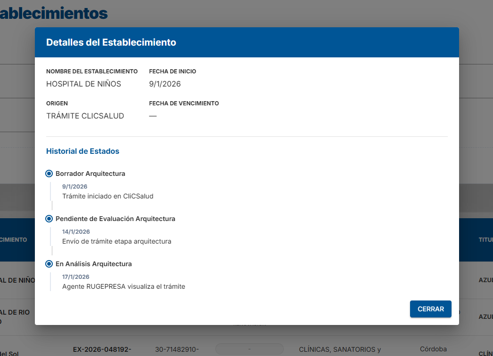
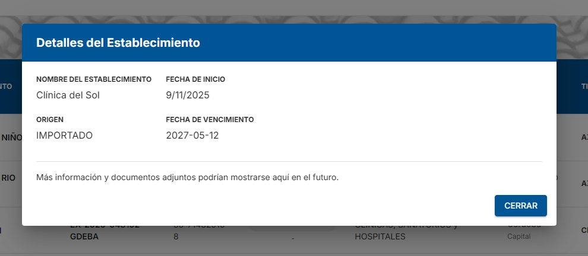

# Vista Ministerio

> **Como** Agente Consultor
> **Quiero** visualizar todos los establecimientos de la provincia y su estado actual
> **Para** consultar la habilitación de todos los establecimientos de salud de la provincia de Córdoba.

---

## 📝 DESCRIPCIÓN

La pantalla consta de una grilla que lista la totalidad de los establecimientos de salud de la provincia, permitiendo su consulta y seguimiento detallado.

---

## ✅ CRITERIOS DE ACEPTACIÓN

#### 1. Permisos y Accesibilidad

- **1.1 Exclusividad del Rol:** Esta vista es accesible únicamente para usuarios con el rol `Agente Consultor`.
- **1.2 Modo de Lectura (Solo Consulta):** Esta pantalla es estrictamente de consulta. No está permitido realizar modificaciones, ediciones ni eliminaciones sobre ningún dato o registro.

#### 2. Filtros de Búsqueda

- **2.1 Buscador y Filtros:** Se debe incluir una sección de búsqueda y filtrado por los siguientes campos:
  - N° de Expediente
  - Nombre del Establecimiento
  - CUIT
  - Estado del Trámite
  - Estado del Establecimiento
  - Tipología
  - Tipo de Trámite
  - Departamento
  - Localidad

- **2.2 Dependencia de Localidad:** El filtro de "Localidad" depende de la opción seleccionada en "Departamento". Si el campo "Departamento" está vacío, "Localidad" no tendrá dependencia.

- **2.3 Acciones de Filtrado:** La sección de filtros debe incluir dos botones principales:
  - **[Buscar]:** Aplica los filtros ingresados y actualiza la grilla de resultados.
  - **[Limpiar]:** Restablece todos los campos de búsqueda a su estado original (vacío) y recarga la grilla sin filtros.

#### 3. Bandeja Principal (Grilla de Establecimientos)

- **3.1 Visualización de Datos:** La tabla principal debe mostrar las siguientes columnas:

| Estado del Establecimiento | Nombre del establecimiento |  Expediente   | CUIT / CUIT Titular |                   Estado                    |            Tipología            | Ubicación (Localidad - Departamento) | Titularidad |     Acciones     |
| :------------------------: | :------------------------: | :-----------: | :-----------------: | :-----------------------------------------: | :-----------------------------: | :----------------------------------: | :---------: | :--------------: |
|       Estado actual        |      Nombre completo       | N° Expediente |        CUIT         | Estado del último trámite y tipo de trámite | Tipología (Clínica, GER., etc.) |              Ubicación               | Titularidad | Botón Visualizar |

- **3.2 Acción de Visualización:** Cada fila debe contar con un botón único de acción representado por el icono de un **Ojo**. Al posicionar el cursor sobre él (hover), debe desplegar el tooltip: `"Visualizar"`. Al seleccionarlo, se debe abrir el popup de "Detalle del Establecimiento".

- **3.3 Totalizador:** Se debe mostrar un indicador que refleje la cantidad total de establecimientos listados en la grilla (respetando los filtros aplicados).

- **3.4 Descargar Reporte de Establecimientos:** El usuario podrá descargar un reporte en PDF del listado de establecimientos haciendo clic en el botón "Descargar Reporte de Establecimientos". Para el detalle del contenido y formato del documento, consultar el [Reporte de Establecimientos](../../Reportes/Reporte%20de%20Establecimientos.md).

#### 4. Modal de Detalle del Establecimiento

- **4.1 Comportamiento del Contenedor:** Al hacer clic en la acción "Visualizar" (ícono de ojo), se abrirá un diálogo modal centrado que superpondrá la pantalla principal, oscureciendo el fondo. El modal se podrá cerrar mediante un botón `[CERRAR]` ubicado en el pie del mismo.

- **4.2 Información Adicional:** El modal mostrará la siguiente información detallada del establecimiento:
  - **Nombre del Establecimiento**
  - **Fecha de Inicio**
  - **Origen**
  - **Fecha de Vencimiento**

- **4.3 Historial de Estados:** Si el origen del establecimiento corresponde a un trámite vía "CLICSALUD", se mostrará adicionalmente un historial con los estados por los que ha pasado.

---

---

## 🎨 PROTOTIPOS DE INTERFAZ

### 1. Bandeja Establecimiento

### 2. Modal Detalles del Establecimiento - Origen Trámite

### 3. Modal Detalles del Establecimiento - Origen Importar

---

## 🕛 HISTORIAL DE CAMBIOS

| VERSIÓN | FECHA      | BREVE DESCRIPCIÓN        | NOMBRE DEL AUTOR |
| :-----: | :--------- | :----------------------- | :--------------- |
|   0.1   | 08/06/2026 | Versión inicial de la HU | Autor            |
