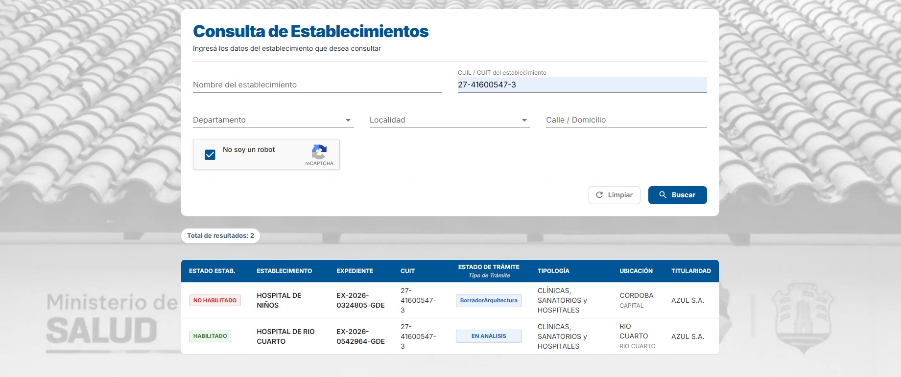
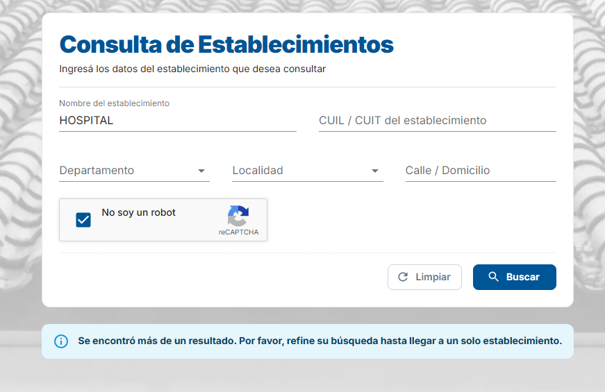
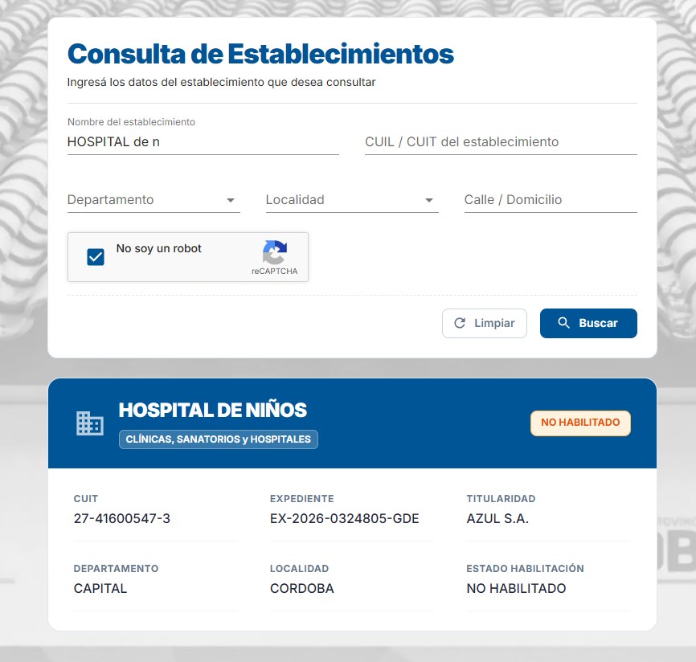

# Vista Consultor

> **Como** Consultor Externo
> **Quiero** buscar establecimientos de salud mediante la combinación de filtros avanzados,  
> **Para** acceder al detalle de instituciones específicas cumpliendo con las restricciones de seguridad de datos de la plataforma.

---

## 📝 DESCRIPCIÓN

Esta pantalla expone un panel de filtros avanzados para el rol `Consultor Externo`. El sistema permite la combinación de parámetros de búsqueda, pero restringe la visualización de resultados en la grilla mediante una regla estricta de "Refinamiento Obligatorio", **excepto** cuando la búsqueda se efectúa bajo el flujo prioritario de un número de CUIT.

---

## ✅ CRITERIOS DE ACEPTACIÓN

#### 1. Filtros de Búsqueda

- **1.1 Validación de Seguridad (Captcha):** Para garantizar la seguridad y evitar consultas automatizadas masivas, es obligatorio resolver satisfactoriamente un desafío de **reCAPTCHA** antes de poder realizar cualquier consulta. Si el captcha no es resuelto, la búsqueda no podrá ejecutarse.
- **1.2 Acciones de Filtrado:** La sección de filtros debe incluir dos botones principales:
  - **[Buscar]:** Permite ejecutar la consulta de acuerdo con las reglas de flujo definidas, previa validación del Captcha.
  - **[Limpiar]:** Restablece todos los campos del formulario a su estado vacío original, reinicia el Captcha, oculta inmediatamente la grilla de resultados (o cualquier mensaje de advertencia) y devuelve la vista a su estado inicial.

#### 2. Resultados (Grilla y Reglas de Visualización)

- **2.1 Estado Inicial:** Al ingresar a la pantalla, la sección de resultados (grilla) debe estar totalmente oculta e invisible.
- **2.2 Flujo Búsqueda por CUIT/CUIL:**
  - Si el campo `CUIT` contiene un número válido y se ejecuta la búsqueda, el sistema ingresa en el **Camino de CUIT**.
  - En este flujo, la grilla de resultados **se libera por completo** permitiendo listar múltiples resultados de manera simultánea.
  - Si el usuario combina el CUIT con otros filtros, el sistema refinará la búsqueda de manera acumulativa pero acotado exclusivamente al conjunto de establecimientos vinculados a ese CUIT.
  - _Ejemplo esperado:_ Si el CUIT `27416005473` tiene asociados el _"Hospital de Niños"_, el _"Hospital del Sol"_ y la _"Clínica Vélez Sarsfield"_, al buscar por dicho `CUIT` junto al texto `"hospital"`, el sistema listará **2 resultados** en la grilla sin disparar bloqueos.
- **2.3 Flujo Búsqueda sin CUIT:**
  - Si el campo `CUIT` se encuentra vacío y el usuario busca utilizando cualquier otra combinación de filtros (Nombre, Departamento, Localidad), se activa de manera obligatoria la restricción por seguridad.
  - Si la búsqueda arroja **más de 1 coincidencia** en la base de datos, el sistema **no renderizará la grilla**. En su lugar, presentará un cartel de advertencia.
- **2.4 Mensaje de Refinamiento Obligatorio:**
  - El cartel de advertencia del flujo restringido (punto 2.3) debe indicar claramente el siguiente mensaje:
    > _Se encontró más de un resultado. Por favor, refine su búsqueda hasta llegar a un solo establecimiento."_
  - La grilla solo se desbloqueará y renderizará el registro si el conjunto de filtros aplicados arroja **exactamente 1 sola coincidencia**.

---

## PROTOTIPOS DE INTERFAZ

#### Bandeja Vacía

#### Flujo Búsqueda por CUIL/CUIT - Resultados multiples

#### Flujo Búsqueda sin CUIL/CUIT

No se encontro coincidiencia exacta, tiene que refinar la busqueda.

Se encontro coincidiencia exacta, se muestra la card del establecimiento.

---

## 🕛 HISTORIAL DE CAMBIOS

| VERSIÓN | FECHA      | BREVE DESCRIPCIÓN        | NOMBRE DEL AUTOR      |
| :-----: | :--------- | :----------------------- | :-------------------- |
|   0.1   | 08/06/2026 | Versión inicial de la HU | Talavera, María Azul. |
