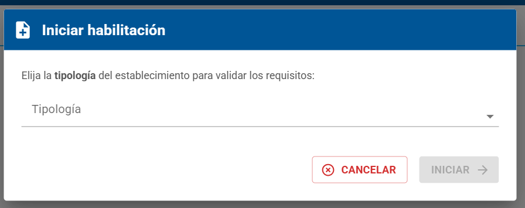

# HU 1.1.2.8 - Modal Iniciar Habilitación (Validación de Tipología)

> **Como** usuario con perfil autorizado (Efector),  
> **quiero** visualizar los requisitos y restricciones de infraestructura al seleccionar una tipología,
> **para** asegurar que mi establecimiento cumple con las condiciones necesarias antes de iniciar el trámite formal.

## 📝 DESCRIPCIÓN
Este modal se dispara al seleccionar "Alta de Habilitación" en el Speed Dial. Su función es actuar como un "filtro preventivo" mostrando información dinámica basada en la tipología seleccionada antes de permitir el inicio del trámite.

## ✅ CRITERIOS DE ACEPTACIÓN
1. Elementos del Modal
   1. Título: "Iniciar habilitación".
   2. Texto instructivo: *"Elija la tipología del establecimiento para validar los requisitos:"*.
   3. Selector de Tipología: campo desplegable con el listado de opciones (Consultorio, Centro de Salud Ambulatoria, etc.).
   4. Botones: "CANCELAR" e "INICIAR".

2. Dinámica de Selección e Información
   1. Al seleccionar una tipología, el sistema debe mostrar automáticamente debajo del selector:
      1. Leyenda: *"Antes de iniciar, revisar la información con respecto a la infraestructura requerida y la **NO requerida** correspondiente a dicha tipología, para evitar que su trámite sea rechazado:"*
      2. Alerta Verde (Infraestructura Requerida / Permitida): Detalla lo que el establecimiento debe tener.
      3. Alerta Roja (Restricciones - No debe poseer): Detalla lo que el establecimiento tiene prohibido tener para esa categoría.
   2. Si el usuario cambia de tipología en el selector, el contenido de ambos bloques debe actualizarse inmediatamente.

3. Tabla de Datos para cada tipología (Lógica de Negocio): El sistema debe mostrar la información según la siguiente tabla:
 
    TIPOLOGÍA|INFRAESTRUCTURA REQUERIDA / PERMITIDA|RESTRICCIONES (NO DEBE POSEER)
    |:--:|:--|:--|
    Consultorio|Sala de Procedimientos mínima, hasta 4 profesionales de una misma rama.|Unidad funcional, camas de internación, prácticas intervencionistas.
    Centro de Salud Ambulatoria|Sala de Procedimientos y camas de Uso Transitorio (Observación).|Quirófanos de cualquier tipo, camas de Internación General.
    Centro Cirugía Ambulatoria|Quirófano, Sala de Procedimiento y recuperación de Uso Transitorio.|Camas de Internación General, Terapia Intensiva (UTI), Neonatología.
    Clínica, Sanatorio u Hospital Privado|Quirófanos, Salas de Parto, Terapias (UTI/UCO/UTIP/Neo), Shock Room e Internación General.|Ninguna
    GER.|Camas de Internación Prolongada y Sala de Procedimientos.|Quirófanos, UTI, UCO, UTIP, NEO.
    Diálisis|Sala de hemodiálisis, tratamiento de agua y área de recuperación.|Quirófanos, Internación General fuera de la específica del tratamiento.

4. Botón [INICIAR]:
   1. Debe estar deshabilitado por defecto.
   2. Se habilitará únicamente después de que el usuario haya seleccionado una tipología.
   3. Al hacer clic en [INICIAR], el sistema debe crear el borrador del trámite con la tipología elegida y redirigir al Paso 1 del formulario.

5. Cancelación: Al presionar "CANCELAR", el modal se cierra y el usuario vuelve al Home sin ninguna acción adicional.

#### Criterios de aceptación de seguridad (NO deben pasar, se deben probar principalmente desde la API)

## 🖼️ PROTOTIPOS DE INTERFAZ

#### Modal "Iniciar Habilitación"
Escenario: El efector seleccióno el botón "Iniciar Habilitación" desde el [Speed dial] del inicio.

#### Modal "Iniciar Habilitación" - Seleccionando tipología
Escenario: el efector seleccionó una tipología del desplegable.  
Resultado: Se muestran los requisitos permitidos y no permitidos para esta tipología.

## 🧩 ELEMENTOS DEL PROTOTIPO

CAMPO|COMPONENTE (MUI)|TIPO
|:--|:--:|:--|
Iniciar habilitación (Cabecera)|Typography (h6) + Icon|Título
Tipología|Autocomplete / Select|Selección
Infraestructura Requerida / Permitida|Paper (Alert Severity="success")|Contenedor Visual
Restricciones (No debe poseer)|Paper (Alert Severity="error")|Contenedor Visual
Icono Check|CheckCircleOutlineIcon|Estático
Icono Alerta|ErrorOutlineIcon|Estático
Textos de requisitos y restricciones|Typography (body2)|Estático
[CANCELAR]|Button Outlined (Color Error)|Acción
[INICIAR]|Button Contained (Color Primary)|Acción
Icono Flecha (Botón Iniciar)|ArrowForwardIcon|Decorativo
Overlay (Fondo del modal)|Backdrop / Modal|Estructural

## 🕛 HISTORIAL DE CAMBIOS

|  VERSIÓN  |  FECHA  |  BREVE DESCRIPCIÓN  |  NOMBRE DEL AUTOR| 
|  :---:  |  :---  |  :---  |  :---| 
|  1  |  3/4/2026  | Primera versión de la HU.   | Talavera, María Azul. | 

