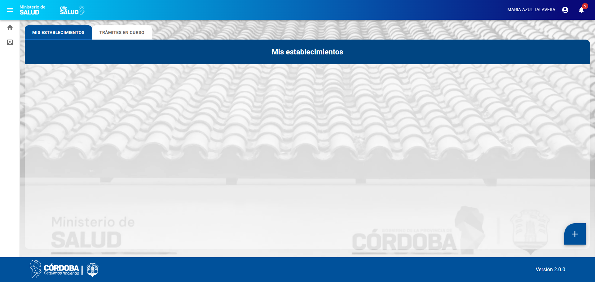

# HU 1.1.2.1 - Disposición de la pantalla y Navegación (Home Efector)
>**Como** usuario con perfil autorizado (Efector),  
>**quiero** visualizar una estructura de pantalla organizada y herramientas de navegación claras,  
>**para** poder acceder de forma intuitiva a mis establecimientos y gestiones de trámites.

## 📝 DESCRIPCIÓN
Se define el Layout (disposición de la pantalla) del Home para el perfil Efector. Incluye el menú lateral de acceso rápido, la barra superior con información del usuario y el contenedor principal donde se alojan las pestañas de gestión.

## ✅ CRITERIOS DE ACEPTACIÓN
1. Se debe respetar el Documento de Estilo vigente (colores, tipografía y espaciado).
2. Estructura General (Layout): El sistema debe presentar una disposición de pantalla dividida en:
   1. Barra Superior (Header): Información de usuario y notificaciones.
   2. Barra Lateral (Sidebar): Iconos de navegación rápida.
   3. Contenedor Central: Espacio principal para el contenido de las pestañas.
   
3. Barra Lateral de Acceso Rápido (Sidebar):
   1. Ubicada en la columna izquierda, debe contener los siguientes iconos:
      1. Home Principal: Representado por el icono correspondiente. Al hacer clic, refresca el Home o redirige a la pantalla principal del Efector.
      2. Bandeja de Trámites: Representado por el icono correspondiente. Al hacer clic, redirige a la bandeja general de trámites del usuario.

4. Cabecera y Gestión de Cuenta (Header)
   1. Identificación: Debe mostrar el nombre completo del usuario logueado (recuperado de CiDi).
   2. Menú de Usuario: Al hacer clic en el nombre del usuario, se debe desplegar un menú con la opción "Cerrar Sesión".
   3. Notificaciones: Se debe visualizar el icono de la "Campana". Al interactuar, permitirá ver mensajes o cambios de estado (Nota: la lógica de lectura de notificaciones pertenece a otra HU, aquí solo se define su posición).

5. Sistema de Pestañas:
   1. El contenedor principal debe presentar tres pestañas claramente diferenciadas:
      1. Mis Establecimientos: por defecto, la pantalla inicia con esta pestaña seleccionada.
      2. Trámites en curso
   2. La pestaña activa debe estar resaltada visualmente.
   3. Al cambiar de pestaña, el contenido debe actualizarse sin recargar toda la página.

6. Contexto de Representación
   1. El sistema debe validar el tipo de representación con el que el usuario inició sesión.
   2. Los datos visualizados en el Home (trámites y establecimientos) deben filtrarse automáticamente para pertenecer únicamente al sujeto representado.

#### Criterios de aceptación de seguridad (NO deben pasar, se deben probar principalmente desde la API)

## 🖼️ PROTOTIPOS DE INTERFAZ

#### Pantalla Inicio
- **Escenario:** el efector ingresa a ClicSalud.
- **Resultado:** 

## 🧩 ELEMENTOS DEL PROTOTIPO

CAMPO|COMPONENTE (MUI)|TIPO
|:--:|:--|:--|
Barra Superior (Header)|AppBar / Toolbar|Estructural
Nombre Usuario (Logueado)|Typography (body1)|Estático
Icono Notificaciones|Badge + NotificationsIcon|Visual / Acción
Menú Cuenta|Menu / MenuItem|Selección
Cerrar Sesión|ListItemIcon + LogoutIcon|Acción
Barra Lateral (Sidebar)|Drawer (mini variant)|Navegación
Home Principal|IconButton (HomeIcon)|Acción
Mis Trámites (Bandeja)|IconButton (AssignmentIcon)|Acción
Pestañas (Tabs)|Tabs / Tab|Navegación
Indicador Pestaña Activa|Tab (indicatorColor)|Visual

## 🕛 HISTORIAL DE CAMBIOS

|  VERSIÓN  |  FECHA  |  BREVE DESCRIPCIÓN  |  NOMBRE DEL AUTOR| 
|  :---:  |  :---  |  :---  |  :---| 
|  1  |  3/4/2026  | Primera versión de la HU.   | Talavera, María Azul. | 