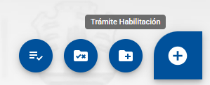

# HU 1.1.2.2 - Speed Dial: Acciones de Inicio de Trámite

**Como** usuario con perfil autorizado (Efector),
**quiero** disponer de un botón de acceso rápido con opciones claramente identificadas,
**para** poder iniciar nuevos trámites de gestión de manera ágil desde el Home.

## 📝 DESCRIPCIÓN
Esta funcionalidad consiste en un botón flotante tipo Speed Dial ubicado en el margen inferior derecho de la pantalla. Al interactuar con él, se despliegan las opciones de trámites que el Efector tiene permitido iniciar según su representación actual.

## ✅ CRITERIOS DE ACEPTACIÓN
1. Debe cumplir con los estándares de diseño definidos en el manual de estilo del proyecto (color, sombra y elevación).
2. Visualización y Ubicación
   1. El botón "+" debe estar fijado en el margen inferior derecho de las tres pestañas del Home (Mis Establecimientos, Trámites en curso, Servicios Radiofísica).

3. Interacción de Despliegue
   1. Al hacer clic o pasar el mouse sobre el botón "+", se deben desplegar de forma horizontal las siguientes opciones:
      1. Trámite Habilitación
      2. Trámite Renovación por Alta Digital
      3. Trámite Adecuación

4. Disparadores de Acción (Navegación)
   1. Alta de habilitación / Renovación por Alta Digital: Al seleccionar estas opciones, se debe abrir el modal de "Iniciar Habilitación" para seleccionar la Tipología (vinculado a la HU 1.1.2.8 Modal Iniciar Habilitación).
   2. Adecuación / Autorización Individual / Cambio de Rep. Legal: Al seleccionar estas opciones, el sistema debe redirigir directamente al Paso 1 del formulario correspondiente, o abrir el modal de inicio según la lógica de negocio de cada trámite.

5. Lógica de Representación
   1. Las opciones del Speed Dial deben estar disponibles únicamente si el usuario ha iniciado sesión con un tipo de representación que posea permisos de escritura/creación.
   2. Si el trámite seleccionado requiere un establecimiento previo (ej: Renovación), el sistema debe validar que existan establecimientos habilitados vinculados al usuario antes de permitir la carga (o manejar el error post-selección).

6. Tooltips (Accesibilidad)
   1. Cada icono o botón desplegado dentro del Speed Dial debe contar con un Tooltip descriptivo que indique el nombre del trámite a iniciar antes de hacer clic.

#### Criterios de aceptación de seguridad (NO deben pasar, se deben probar principalmente desde la API)

## 🖼️ PROTOTIPOS DE INTERFAZ

#### Botón Speed Dial
- **Escenario:** se muestra el speed dial sin acciones.
- **Resultado:** 

#### Botón Speed Dial desplegado
- **Escenario:** el efector hace Hover o Click con el mouse sobre el botón.
- **Resultado:** 

#### Botón Speed Dial desplegado y tooltip
- **Escenario:** el efector hace Hover con el mouse sobre una de las opciones del speed dial.
- **Resultado:** 

## 🧩 ELEMENTOS DEL PROTOTIPO

CAMPO|COMPONENTE (MUI)|TIPO
|:--:|:--|:--|
Botón Flotante "+"|SpeedDial|Acción
Icono Cerrar (Speed Dial activo)|SpeedDialAction (openIcon)|Visual
Alta de Habilitación (Opción)|SpeedDialAction|Acción
Renovación (Opción)|SpeedDialAction|Acción
Cambio Rep. Legal (Opción)|SpeedDialAction|Acción
Adecuación (Opción)|SpeedDialAction|Acción
Autorización Individual (Opción)|SpeedDialAction|Acción
Tooltips Opciones|Tooltip|Informativo
Mis Trámites (Bandeja)|IconButton (AssignmentIcon)|Acción
Pestañas (Tabs)|Tabs / Tab|Navegación
Indicador Pestaña Activa|Tab (indicatorColor)|Visual

## 🕛 HISTORIAL DE CAMBIOS

|  VERSIÓN  |  FECHA  |  BREVE DESCRIPCIÓN  |  NOMBRE DEL AUTOR| 
|  :---:  |  :---  |  :---  |  :---| 
|  1  |  3/4/2026  | Primera versión de la HU.   | Talavera, María Azul. | 
