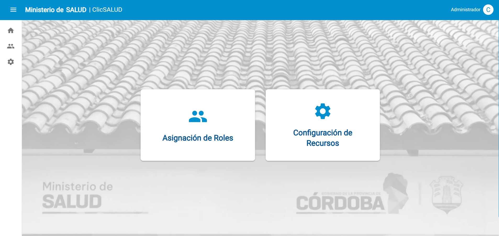
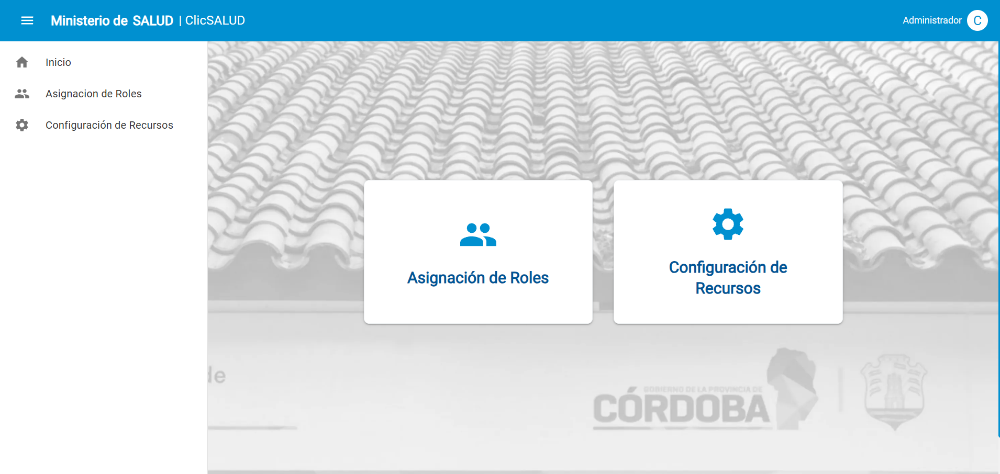

# 1.1.3 - Visualizar HOME - Administrador

> **Como** Usuario con perfil autorizado (Administrador)  
> **Quiero** acceder a un panel centralizado de administración  
> **Para** gestionar los recursos, roles y configuraciones del sistema ClicSalud.

## 📝 DESCRIPCIÓN
Esta funcionalidad permite al usuario con rol Administrador acceder al home de ClicSalud.

Desde esta pantalla, el usuario puede visualizar los módulos críticos de gestión.

La interfaz debe presentar tarjetas (Cards) de acceso directo hacia las funcionalidades:
- Asignación de roles
- Configuración de recursos

## ✅ CRITERIOS DE ACEPTACIÓN
1. Cumplir con los criterios definidos en el documento de estilo.
2. Se deben visualizar, dos cards principales:
   1. Asignación de Roles: Redirige a la gestión de permisos de usuarios.
   2. Configuración de Recursos: Redirige a las configuraciones de recursos de los trámites.
3. Las tarjetas deben presentar un efecto visual (hover) que resalte el borde o aumente la elevación al pasar el cursor, indicando que son clickeables.
4. El menú lateral debe mostrar los iconos de Home, Asignación de Roles (Personas) y Configuración (Engranaje).
5. Al hacer clic en el icono de Menú, el Sidebar debe desplazarse lateralmente según el estándar de la plataforma.

#### Criterios de aceptación de seguridad (NO deben pasar, se deben probar principalmente desde la API)
1. Criterio de seguridad

## 🖼️ PROTOTIPOS DE INTERFAZ

#### Pantalla 1: Home Principal
Escenario: El administrador inicia sesión exitosamente.  
Resultado: Se visualiza el panel con las Cards centradas en la pantalla. 

#### Pantalla 2: Menú Lateral Expandido
Escenario: El usuario hace clic en el icono de tres barras superior izquierdo.
Resultado: Se despliega el listado de funcionalidades en la barra lateral.

## 🧩 ELEMENTOS DEL PROTOTIPO

| CAMPO | IMÁGEN | TIPO | ACCIÓN | DESCRIPCIÓN |
| :--- | :---: | :--- | :--- | :--- |
|   |   |   |   |   |

## 🔄 DIAGRAMA DE TRANSICIÓN DE ESTADOS

## 🕛 HISTORIAL DE CAMBIOS

|  VERSIÓN  |  FECHA  |  BREVE DESCRIPCIÓN  |  NOMBRE DEL AUTOR| 
|  :---:  |  :---  |  :---  |  :---| 
|  1.0  | 20/02/2026   | Creación inicial de HU   | Talavera, María Azul | 
